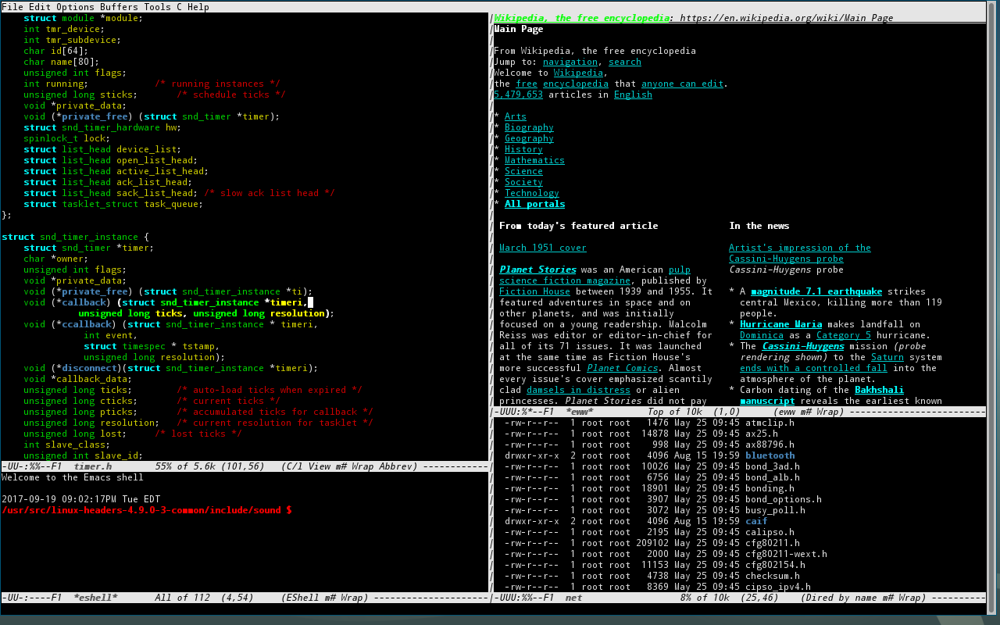
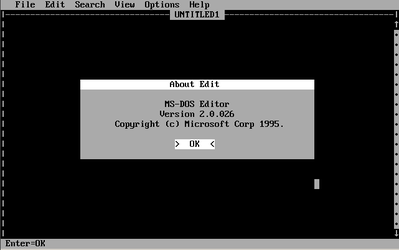
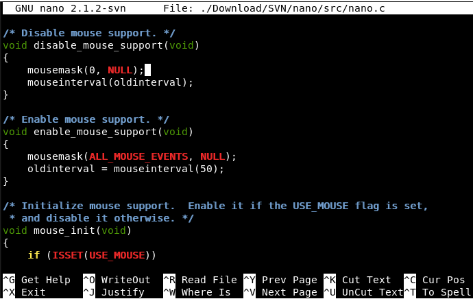

# Milestone 1
For this milestone, you must develop a GUI for your text editor.  Your GUI doesn't have to actually do anything (e.g. copy/paste, open files, etc.).  All it has to do is to lay the groundwork for future development.  

## Grading
This assignment is worth 50 points.  Your grade will be based on the following:
* Regular, appropriately sized github checkins (no single-line checkins, no 1000+ line checkins)
* Tracking progress on your github project board and github issue tracker
* Maintaining a [design diary](milestone1_design_diary.md) for this assignment
* Adding [cool links and tutorials](../../../docs/guides.md) that you encounter
* Completing the project / making reasonable progress

## Due Date
This assignment is due Midnight, September 10, 2019.  You will turn in your project by checking your code into github.  Once checked in, [create a milestone 1 release](https://help.github.com/en/articles/creating-releases).

## Examples

For inspiration, below are several screenshots from text-based editors

### Emacs
Favorite of Sharon Tuttle.

### Edit for MS-DOS
I used to use this one when I was a kid.

### Nano
My preferred Unix editor because I can never remember the vi/vim commands.

### Vim
Popular among command-line hackers. 
