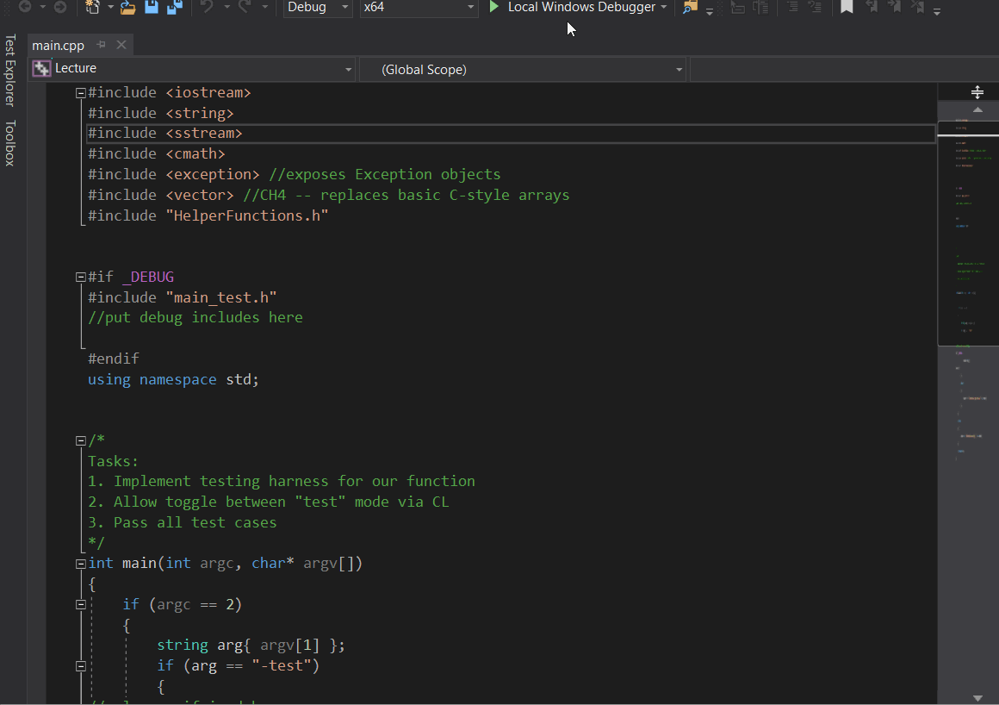

# Milestone 2
In our next milestone, you will load a file from the command line and display its contents.  In doing so, you will have to consider several factors:

1. How do you read input parameters from the command line?  For example, if you type "TextEdit.exe myFile.txt", how do you get that file to load in your program?  In Visual Studio 2019, you'll need to set up the command line arguments in the project properties [See this SO question](https://stackoverflow.com/questions/298708/debugging-with-command-line-parameters-in-visual-studio)
2. How do you handle documents whose contents exceed the height and/or width of your window?  
   a. For horizontal constraints, are you going to word wrap, allow for horizontal scrolling, or both?
   b. How will you inform the user that there is "more content" beyond their view.  Will you use a scroll bar to track progress?
   c. How will your program track what should next be displayed?

## Grading
This assignment is worth 100 points.  Your grade will be based on the following:
* Usage of at least one STL vector or STL list data structure
* Regular, appropriately sized github checkins (no single-line checkins, no 1000+ line checkins)
* Tracking progress on your github project board and github issue tracker
* Maintaining a [design diary](milestone2_design_diary.md) for this assignment
* Adding [cool links and tutorials](../../../docs/guides.md) that you encounter
* Completing the project / making reasonable progress

## Due Date
This assignment is due midnight, September 20, 2019.  You will turn in your project by checking your code into github.  Next, create an GIF walkthrough of your program using [LICEcap](https://forum.lumberhacks.org/viewtopic.php?f=10&t=9).  Upload this image to your repository and put a link to the image in your reflection. *Be sure to place your reflection in this folder!* Lastly, once everything is checked in, [create a milestone 2 release](https://help.github.com/en/articles/creating-releases).

## Example Walkthrough Image
Here is an image that I made running some lecture code.  Yours should look pretty similar but with PA #2.
