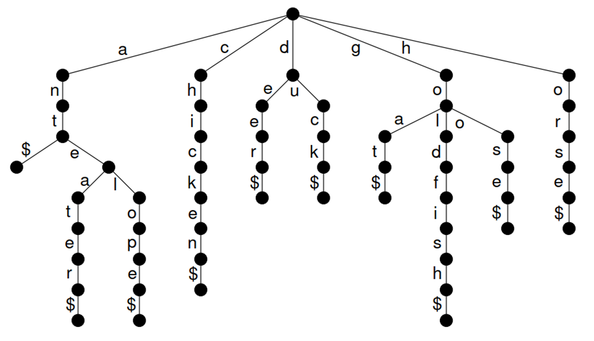
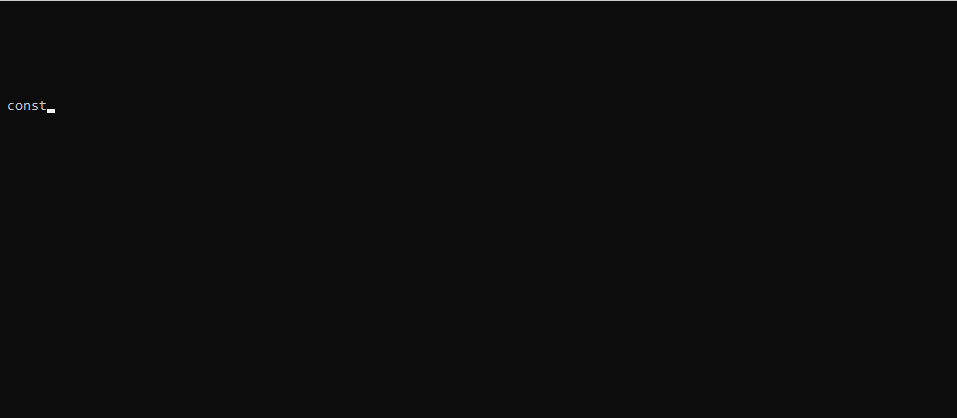
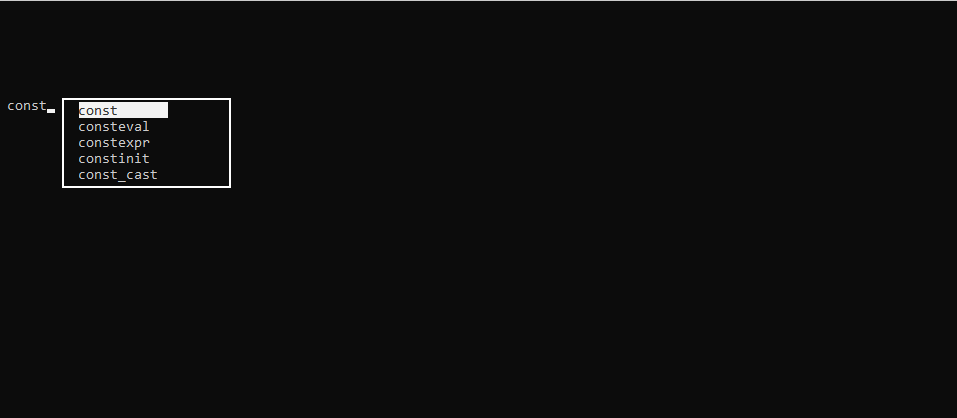

# Milestone 5
In our next milestone, you will use a special type of tree called a Trie (pronounced "try") to add autocomplete for C++ reserved keywords to your program.  Chapter 13.1 in the book has a great discussion on how Tries work.  I highly suggest starting the assignment by first reading the book.  [Wikipedia](https://en.wikipedia.org/wiki/Trie) also has a pretty good article on Tries.  While there are multiple trie-based dictionary implementation strategies, we will take the most straightforward approach.  Each node in the trie will represent a single character in a word.  Trie nodes that have the '$' sentinel value as a child indicate the end of a word.  Words are constructed by performing a pre-order traversal through our trie, stopping at the sentinel value.  Here's an example trie pulled from the book:

Note that each branch represents a possible character sequence in a word.  Thus, in the 'a' subtree, we are aware of the words "ant", "anteater", and "antelope."  

For this milestone, you will build a try from the provided [keywords.txt](keywords.txt) file, which contains all of the reserved C++ keywords.  Then, whenever a user begins typing and initiates auto-complete (e.g. using CTRL+SPACE), your program should provide some sort of autocomplete interface where the user can select the correct keyword.  Once selected, this keyword is then inserted into the text document.  

## Example Workflow
Assume that the user begins by typing "const"...

Next, the user pushes the autocomplete keyboard shortcut (your choice), which brings up the autocomplete menu...

From this menu, the user selects the desired autocomplete word and pushes enter (or whatever key of your choosing).  The menu then closes and the completed word is injected into the text editor.

## Trie Files
Inside the [examples](../../examples/tries/TrieTextPredict/) folder, you will find an example project with skeleton code for a Trie.  Note that you must use this code as your foundation -- copy it to your TextEditor project.  While TrieNode.h is fully fleshed out, you'll need to complete the implementation of Trie.h functions addWord() and search(), which are used to perform lookups on words.  

## Grading
This assignment is worth 100 points.  Your grade will be based on the following:
* Regular, appropriately sized github checkins (no single-line checkins, no 1000+ line checkins)
* Tracking progress on your github project board and github issue tracker
* Maintaining a design diary for this assignment
* Completing the project / making reasonable progress

## Due Date
This assignment is due midnight, November 1, 2019.  You will turn in your project by checking your code into github.  Next, create an GIF walkthrough of your program using [LICEcap](https://forum.lumberhacks.org/viewtopic.php?f=10&t=9).  Upload this image to your repository and put a link to the image in your reflection. 
